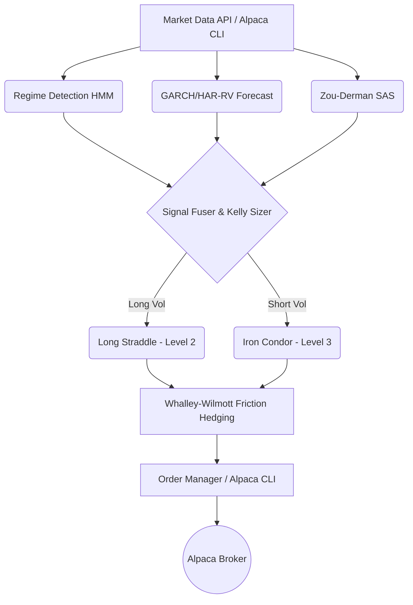

<div align="center">
  

  # Alpaca Volatility Agent 🦙📉
  
  **An autonomous options volatility-trading & hedging agent for Alpaca's paper trading environment.**
  
  *Built for the [Alpaca AI Trading Agents Hackathon](https://lablab.ai/ai-hackathons/alpaca-ai-trading-agents-hackathon)*

  [](https://opensource.org/licenses/MIT)
  [](https://www.python.org/downloads/)
  [](https://alpaca.markets/docs/)
  [](https://alpha-trading-deployment-lastcommit-dun.vercel.app/dashboard)

  ### 🌐 **Live Web Application & Research Terminal**
  **[https://alpha-trading-deployment-lastcommit-dun.vercel.app/dashboard](https://alpha-trading-deployment-lastcommit-dun.vercel.app/dashboard)**
</div>

---

## ⚡ The Elevator Pitch

**Alpaca Vol Agent** is an autonomous, quantitative options trading system that harvests volatility risk premium (VRP). It fuses a regime-conditional HMM, GARCH/HAR-RV volatility forecasting, and Kelly sizing with transaction-cost-aware hedging—all executing seamlessly through Alpaca's official CLI.

This isn't just an LLM making random guesses. It's a mathematically grounded **Volatility-Harvesting Agent** combined with a **Portfolio Hedge Overlay**, representing the pinnacle of "Options Alpha" for this hackathon.

---

## 📸 Interactive Terminal Showcase

Explore the live quantitative research terminal and execution system in action:

<div align="center">
  <h3>1. Complete Research Terminal Overview</h3>
  
  <p><em>Full-page view of the VOL/AGENT Research Terminal displaying real-time market data, model signals, and execution status.</em></p>
</div>

<br>

<div align="center">
  <table>
    <tr>
      <td width="50%">
        <h4 align="center">2. Topbar Header & Portfolio KPIs</h4>
        
        <p align="center"><em>Real-time market clock, live status indicators, account equity ($100k), and buying power ($400k).</em></p>
      </td>
      <td width="50%">
        <h4 align="center">3. Multi-Model Signal Decomposition</h4>
        
        <p align="center"><em>VRP comparison (Forecast Vol 10.5% vs Live ATM IV 9.3%), z-score calculation (+2.26), and Long Vol composite edge.</em></p>
      </td>
    </tr>
    <tr>
      <td width="50%">
        <h4 align="center">4. Regime Detection & Risk Throttles</h4>
        
        <p align="center"><em>HMM Regime ('Trend'), Gamma Posture, VPIN Flow Toxicity, and dynamic size scaling multipliers.</em></p>
      </td>
      <td width="50%">
        <h4 align="center">5. Interactive Backtest Sandbox</h4>
        
        <p align="center"><em>On-demand historical backtesting with friction modeling (Sharpe Ratio, CAGR, Max Drawdown, Friction Paid).</em></p>
      </td>
    </tr>
    <tr>
      <td width="50%">
        <h4 align="center">6. Live Options Chain & Portfolio Greeks</h4>
        
        <p align="center"><em>Real-time SPY options chain matrix, DTE filters, and net aggregate Greek exposures (Delta, Gamma, Vega, Theta).</em></p>
      </td>
      <td width="50%">
        <h4 align="center">7. Automated Decision Audit Trail</h4>
        
        <p align="center"><em>Fractional Kelly allocation (+15.00% / $15,000 budget), execution rationale, and order execution logs.</em></p>
      </td>
    </tr>
  </table>
</div>

---

## 🌪️ The Problem & The Solution

**The Problem:** Most AI trading agents are either "black boxes" blindly firing API requests or lack a true mathematical edge, ignoring critical constraints like transaction costs, portfolio greeks, and broker-specific options levels.

**The Solution:**
Our agent reads real implied volatility directly off Alpaca's live chain, cross-validates it using an independent, purely historical signal (Zou-Derman Strike-Adjusted Spread), and executes fractional-Kelly sized Iron Condors or Straddles. Every trade is delta-hedged using a min-variance ratio with Whalley-Wilmott no-trade bands to prevent bleeding out to spread and slippage.

---

## 🧠 Core Alpha Architecture

<div align="center">
  
</div>

Our architecture represents a sophisticated pipeline, not a simple heuristic:



### 1. Regime-Conditional HMM
4-state Hidden Markov Model regime detection (Range, Trend, Vol_Expansion, Crash).

### 2. Live VRP & Volatility Forecasting
GARCH(1,1) + HAR-RV blended forecast checked against live implied volatility read straight from Alpaca's option chain.

### 3. Rigorous Hedging & Sizing
Fractional-Kelly risk budget with gamma/vega capped limits. Re-sizes dynamically based on the current book's actual risk.

---

## 🛡️ Tooling Compliance (READ THIS)

**The playbook requires using Alpaca's MCP server or CLI.** 
This project strictly routes **every** Alpaca call through `subprocess.run(["alpaca", "api", METHOD, path, ...])`. 

We use the official CLI's raw escape hatch (`alpaca api METHOD <path>`). Nothing here calls `requests` or `alpaca-py` directly for trading. This ensures robust tooling compliance while maintaining the lightning-fast execution required for options delta hedging.

*(See the `OLD_README.md` for our extended writeup on Alpaca Trading Level Constraints).*

---

## 🚀 Quickstart Guide

### 1. Setup your Environment
Create a **NEW** paper account at [Alpaca](https://app.alpaca.markets).
Install the Alpaca CLI (Required for Tooling Compliance):
```bash
go install github.com/alpacahq/cli/cmd/alpaca@latest
alpaca version
```

### 2. Configure Credentials
```bash
export ALPACA_API_KEY=PK...
export ALPACA_SECRET_KEY=...
alpaca account get --quiet
```

### 3. Install Python Dependencies
```bash
git clone https://github.com/WoLfy15/ALPACA-VOL-AGENT.git "Alpaca Trading"
cd "Alpaca Trading"
pip install -r requirements.txt
cp .env.example .env
```

### 4. Run the Agent (Dry-Run Mode)
Computes everything (regime, forecast vol, SAS, sizing) without submitting real orders.
```bash
python cli.py run --once
```

### 5. Go Live (Paper Trading)
Ready to dominate? Start the live loop:
```bash
python cli.py run --loop --interval 900 --live
```

### 6. Launch the Dashboard Backend
```bash
python cli.py serve --port 8000
```

---

## 🔮 Future Roadmap

- **RL Execution Extension:** Integrating a PPO execution agent trained on a synthetic Hawkes limit-order-book simulator to optimize order routing.
- **Rough Volatility Surface Calibrator:** Adding a PyTorch neural rough-Bergomi surface calibrator for even deeper options pricing insights.

---

*For deep, extensive technical details on the underlying math, please reference `OLD_README.md`.*

<div align="center">
  <sub>Built with ❤️ and Math for the Alpaca AI Hackathon. Let's win this.</sub>
</div>
